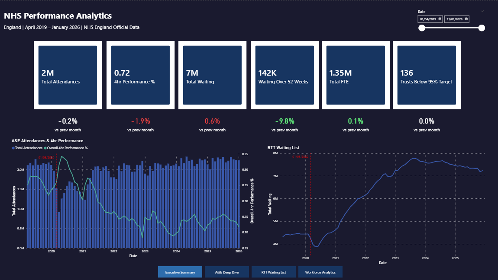
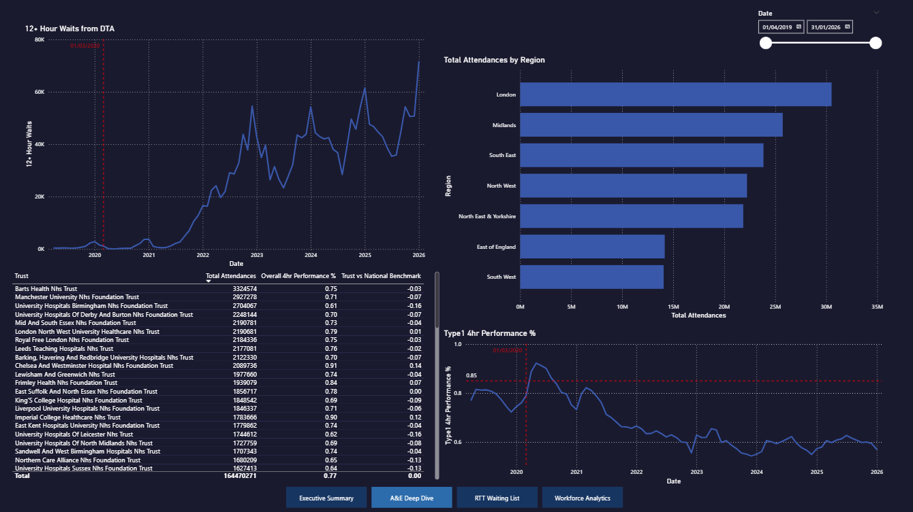
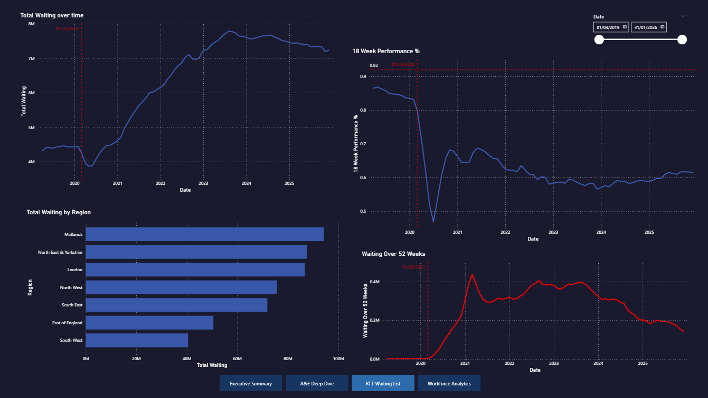
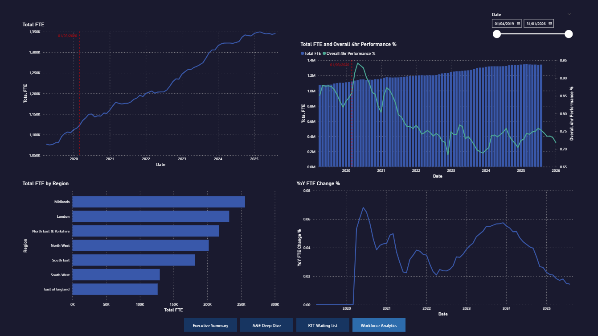

# NHS Performance Analytics Dashboard

An end-to-end analytics project tracking NHS England performance across A&E, Referral-to-Treatment (RTT) waiting times, and workforce from **April 2019 to January 2026** — spanning the COVID-19 pandemic, the elective backlog crisis, and ongoing recovery efforts.

---

## Dashboard Preview

### Executive Summary


### A&E Deep Dive


### RTT Waiting List


### Workforce Analytics


## Key Findings

- **A&E 4hr performance** declined significantly over the period, falling well below the 95% national target and never recovering — driven by rising demand, COVID-19 disruption, and sustained pressure on emergency departments
- **Elective waiting list** grew substantially from 2020 onwards following the suspension of non-urgent treatment during the pandemic, peaking in 2023 before a gradual reduction through 2024–2025
- **52-week waiters** were negligible pre-pandemic and surged dramatically from mid-2020, representing a major policy challenge throughout the recovery period
- **12-hour DTA waits** — a near-absent metric before 2022 — rose sharply from late 2022 onwards, reflecting the most acute end of A&E pressure
- **NHS workforce (FTE)** grew consistently across the period, yet A&E and RTT performance continued to decline — suggesting demand growth and system complexity outpaced staffing gains
- **London** recorded the highest A&E attendances of any region; **Midlands** carried the largest share of the elective waiting list

---

## Project Structure

```
nhs-performance-analytics/
│
├── raw/                          
│   ├── ae/                        # Monthly A&E CSV files
│   ├── rtt/                       # Monthly RTT ZIP files
│   └── workforce/
│       └── monthly/               # Monthly workforce ZIP files
│
├── clean/                         
│   ├── ae_clean.csv               # A&E data | Apr 2019–Jan 2026
│   ├── rtt_clean.csv              # RTT data | Apr 2019–Dec 2025
│   ├── workforce_clean.csv        # Workforce data | Apr 2019–Aug 2025
│   └── reference_clean.csv        # Unified organisation reference table
│
├── scripts/
│   ├── clean_ae.py                # A&E ETL pipeline
│   ├── clean_rtt.py               # RTT ETL pipeline
│   ├── clean_workforce_monthly.py # Workforce ETL pipeline
│   └── clean_reference.py         # Organisation reference table builder
│
├── screenshots/                   # Dashboard page screenshots
├── nhs.pbix                       # Power BI report file
└── README.md
```

---

## Data Sources

All data is sourced from official NHS England publications under the [Open Government Licence](https://www.nationalarchives.gov.uk/doc/open-government-licence/version/3/).

| Dataset | Source | Coverage | Granularity |
|---|---|---|---|
| A&E Waiting Times & Activity | [NHS England](https://www.england.nhs.uk/statistics/statistical-work-areas/ae-waiting-times-and-activity/) | Apr 2019 – Jan 2026 | Monthly, by provider |
| RTT Waiting Times | [NHS England](https://www.england.nhs.uk/statistics/statistical-work-areas/rtt-waiting-times/) | Apr 2019 – Dec 2025 | Monthly, by provider |
| NHS Workforce Statistics | [NHS Digital](https://digital.nhs.uk/data-and-information/publications/statistical/nhs-workforce-statistics) | Apr 2019 – Aug 2025 | Monthly, by provider |

---

## ETL Pipeline

Each dataset required significant cleaning due to column name changes across the 7-year period, NHS organisational restructuring (CCGs → ICBs in 2022), and data quality issues in source files.

### A&E (`clean_ae.py`)
- Processes monthly CSVs across two distinct column schemas caused by a naming convention change mid-series
- Standardises all column variants to a consistent schema regardless of source file vintage
- Parses NHS-format period strings into standard dates
- Derives total attendance, over-4hr, and performance columns

### RTT (`clean_rtt.py`)
- Extracts CSVs from ZIP archives; filters to Part_2 (incomplete pathways) and C_999 (all specialties total)
- Aggregates weekly wait band columns to produce within-18-week and over-52-week totals
- Applies keyword-based region mapping to consolidate a large number of ICB/STP/NHSE region name variants into 7 standard NHSE regions
- Outputs one row per provider per month

### Workforce (`clean_workforce_monthly.py`)
- Extracts the staff group and organisation CSV from each monthly ZIP file
- Filters to total staff group and FTE data type
- Applies a 3-character org code regex filter to retain NHS Trusts only, excluding CCGs, ICBs, and commissioning bodies — providing a stable, comparable cohort across the full period
- Snaps end-of-month dates to 1st of month for consistent joining to the date dimension

---

## Data Model

Star schema in Power BI with a DAX-generated date dimension:

```
dim_date ──────────────── ae_clean
    │                     rtt_clean
    │                     workforce_clean
    │
reference_clean ────────  ae_clean
                          rtt_clean
                          workforce_clean
```

- **dim_date**: Generated via DAX `CALENDAR()`. Columns: Date, Year, Month, Month Name, Quarter, Financial Year (NHS Apr–Mar)
- **reference_clean**: Master organisation lookup across all three datasets

---

## DAX Measures

**A&E**
- `Total Attendances` — SUM of monthly attendances
- `Overall 4hr Performance %` — Attendances seen within 4hrs / total
- `Type1 4hr Performance %` — Type 1 (major A&E) departments only
- `Rolling 3M Avg 4hr Performance` — 3-month rolling average via DATESINPERIOD
- `Trusts Below 95% Target` — Count of trusts failing the national standard
- `National 4hr Benchmark` — England average using ALL(ae_clean)
- `Trust vs National Benchmark` — Trust performance minus national average
- `YoY Attendance Change %` — Year-on-year change via SAMEPERIODLASTYEAR

**RTT**
- `Total Waiting` — Total incomplete pathways
- `Waiting Over 52 Weeks` — Patients waiting longer than one year
- `18 Week Performance %` — Patients treated within 18 weeks / total waiting
- `52 Week Waiters %` — Long waiters as share of total list
- `52 Week Waiters YoY Change %` — Year-on-year change

**Workforce**
- `Total FTE` — Sum of full-time equivalent staff
- `YoY FTE Change %` — Year-on-year workforce growth

**KPI cards**
- Six latest-month KPI measures using `FILTER(ALL(...))` to return the absolute latest month value regardless of slicer position
- Six corresponding MoM % measures computing month-on-month change against the prior period

---

## Dashboard Pages

### 1. Executive Summary
Six KPI cards showing latest-month values with month-on-month change indicators (colour-coded by clinical direction). A&E attendance trend with 4hr performance overlay and RTT waiting list trajectory. Date slicer filters trend charts while KPI cards remain fixed to latest month. COVID-19 annotation line at March 2020.

### 2. A&E Deep Dive
Type 1 4hr performance trend with 95% target reference line; total attendances by region; trust-level league table showing attendances, 4hr performance, and deviation from national benchmark; 12-hour DTA waits over time.

### 3. RTT Waiting List
Total incomplete pathways over time; 18-week performance with 92% target line; waiting list by region; 52-week waiters trend showing near-eradication pre-COVID and post-pandemic surge.

### 4. Workforce Analytics
Total NHS Trust FTE trend; FTE by region; FTE vs 4hr performance overlay highlighting the paradox of rising staffing alongside declining performance; year-on-year FTE change.

---

## Setup & Reproduction

### Requirements
```
Python 3.9+
pandas >= 2.0
openpyxl
```

### Installation
```bash
pip install pandas openpyxl
```

### Running the ETL Pipeline
```bash
# 1. Download raw data to raw/ subfolders (see Data Sources above)

# 2. Run cleaning scripts in order
python scripts/clean_ae.py
python scripts/clean_rtt.py
python scripts/clean_workforce_monthly.py
python scripts/clean_reference.py         # run last — depends on all three clean files

# 3. Open nhs.pbix in Power BI Desktop
# 4. Update data source paths via Transform Data > Source
# 5. Refresh all
```

---

## Design Decisions

**Why filter workforce to NHS Trusts only?**
The dataset includes CCGs, ICBs, and commissioning bodies alongside provider trusts. CCGs were abolished in July 2022 and replaced by Integrated Care Boards, creating a structural break in organisation counts. Filtering to 3-character org codes gives a stable, comparable cohort of provider trusts across the full period.

**Why use Part_2 / C_999 for RTT?**
Part_2 represents incomplete (still-waiting) pathways — the policy-relevant metric for waiting list management. C_999 is the all-specialties aggregate, giving one total per provider per month.

**Why build dim_date using DAX CALENDAR()?**
Power Query date tables caused relationship matching issues when joining to monthly fact tables. A DAX CALENDAR() table resolves this reliably and aligns with Microsoft's recommended approach for Power BI date dimensions.

**KPI cards are slicer-independent by design**
Metrics like waiting list size and FTE represent a point-in-time snapshot — summing across a date range is analytically meaningless. KPI cards always show the absolute latest month value regardless of slicer position.

**Region standardisation**
NHS region labels changed multiple times across 2019–2025 (STP → ICS → ICB → NHSE regions). A keyword-based mapping function in each ETL script consolidates a large number of distinct region name variants into the 7 current NHSE regions.

---

## Limitations

- RTT data ends December 2025; A&E ends January 2026; Workforce ends August 2025 — the datasets do not share a common end date
- Workforce analysis covers NHS Trusts only, not the full NHS provider landscape
- The 95% A&E 4hr target was suspended in March 2020 and replaced by the UEC Recovery Plan in 2022 — cross-period comparisons should account for this policy context
- Some providers appear intermittently, reflecting trust mergers, reconfigurations, and reporting changes rather than genuine closures

---

## Author

Built as a portfolio project demonstrating end-to-end data analytics skills: data acquisition, Python ETL, dimensional modelling, DAX, and Power BI dashboard development.